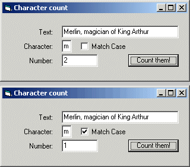



## Count characters in textstring

### Description

Here is an example of how one can count the number of appearances of a specified character in a given textstring.

Included is a little project file with a form.

The code is quite understandable.

Actually it is beginners code.

I just submitted this as a sequel to another submission here on PSC. Not that I find the other submission bad, but to show another way of doing things.
 
### More Info
 

             |
---                |---
**Submitted On**   |2002-05-07 15:18:00
**By**             |[\_Merlin\_](https://github.com/Planet-Source-Code/PSCIndex/blob/master/ByAuthor/merlin.md)
**Level**          |Beginner
**User Rating**    |4.8 (24 globes from 5 users)
**Compatibility**  |VB 5\.0, VB 6\.0
**Category**       |[String Manipulation](https://github.com/Planet-Source-Code/PSCIndex/blob/master/ByCategory/string-manipulation__1-5.md)
**World**          |[Visual Basic](https://github.com/Planet-Source-Code/PSCIndex/blob/master/ByWorld/visual-basic.md)
**Archive File**   |[Count\_char80363572002\.zip](https://github.com/Planet-Source-Code/merlin-count-characters-in-textstring__1-34521/archive/master.zip)

